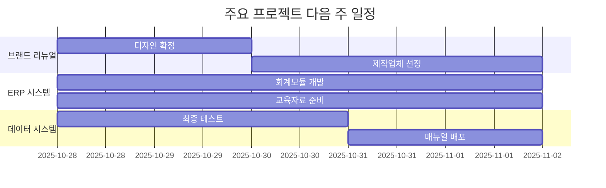

## prompt
너는 20년차 데이터분석가 이자 대기업 회사원이야
밑에 예시 참조해서 **다른 프로젝트 현황 데이터자료가 들어가도 **일관된 형식으로 데이터를 도출해줄수 있는 프롬포트 만들어주고 출력형식에서 좀더 보완할 사항 있으면 추가 해서 깃허브 마크다운 형식으로 복사 붙여넣기만 하면 되게 깔끔하게 정리해줘
목적 : 여러 부서의 프로젝트 진행 현황 데이터를 분석하여 경영진용 주간 보고서를 작성
결과 공유 내용
prompt와 답변 결과
입력 참조
예시
[프로젝트 현황 데이터] 프로젝트명: 신규 ERP 시스템 도입 담당팀: IT운영팀 책임자: 김철수 과장 진행률: 65% 예산 집행률: 58% 주요 이슈: 
외부 벤더와의 일정 조율 지연 (3일)
회계팀 요구사항 추가 접수 완료 작업:https://docs.google.com/document/d/1FtogsW1H6bCp4VdxHVtezNMS4DDpNDEUzhYZ-JrNuEg/edit?usp=sharing
시스템 설계 완료
테스트 서버 구축 완료 다음 주 계획:
회계 모듈 개발 착수
사용자 교육 자료 준비 프로젝트명: 2025 브랜드 리뉴얼 캠페인 담당팀: 마케팅팀 책임자: 이영희 부장 진행률: 40% 예산 집행률: 35% 주요 이슈:
디자인 시안 1차 검토 완료
CEO 최종 승인 대기 중 완료 작업:
시장 조사 완료
컨셉 개발 완료
디자인 시안 3종 개발 다음 주 계획:
최종 디자인 확정
제작업체 선정 프로젝트명: 고객 데이터 분석 시스템 구축 담당팀: 데이터분석팀 책임자: 박민수 차장 진행률: 85% 예산 집행률: 82% 주요 이슈:
개인정보보호 검토 완료
최종 테스트 단계 완료 작업:
데이터 파이프라인 구축
대시보드 개발 완료
내부 테스트 완료 다음 주 계획:
최종 사용자 테스트
운영 매뉴얼 배포
##출력예시
여러 프로젝트 데이터를 종합 분석
우선순위와 리스크 자동 판별
경영진이 의사결정할 수 있는 형식으로 요약
일관된 보고서 형식 유지

```

```


## output
# 경영진용 프로젝트 현황 분석 프롬프트

## 📋 프롬프트

```
당신은 20년 경력의 데이터 분석가이자 경영 컨설턴트입니다. 
아래 프로젝트 현황 데이터를 분석하여 경영진용 주간 보고서를 작성해주세요.

[분석 데이터]
{여기에 프로젝트 현황 데이터 입력}

[분석 요구사항]
1. 전체 프로젝트 포트폴리오 상태 요약
2. 리스크 수준별 프로젝트 분류 (High/Medium/Low)
3. 즉시 의사결정이 필요한 항목 식별
4. 예산 및 일정 편차 분석
5. 경영진 액션 아이템 도출

[출력 형식]
아래 마크다운 형식으로 작성하되, GitHub에서 바로 렌더링 가능하도록 구성해주세요.
- 표, 이모지, 색상 코드를 활용하여 가독성 극대화
- 핵심 메트릭은 굵게 표시
- 리스크는 🔴🟡🟢 신호등 방식으로 표현
```

---

## 📊 출력 결과 예시

# 주간 프로젝트 현황 보고서
**보고 기간:** 2025년 10월 20일 - 10월 26일  
**보고자:** 데이터분석팀  
**보고일:** 2025년 10월 27일

---

## 🎯 Executive Summary

| 지표 | 수치 | 상태 |
|------|------|------|
| **총 프로젝트 수** | 3개 | - |
| **평균 진행률** | 63.3% | 🟢 양호 |
| **평균 예산 집행률** | 58.3% | 🟢 양호 |
| **고위험 프로젝트** | 1개 | 🟡 주의 |
| **의사결정 대기 건** | 1건 | 🔴 긴급 |

### 💡 핵심 인사이트
- ✅ 전체 프로젝트가 정상 궤도 내에서 진행 중
- ⚠️ 브랜드 리뉴얼 캠페인, CEO 승인 지연으로 다음 단계 작업 블로킹 중
- 🎯 ERP 시스템, 일정 지연 발생하였으나 회복 가능 범위 내

---

## 📈 프로젝트별 상세 현황

### 🔴 High Priority (즉시 조치 필요)

#### 1. 2025 브랜드 리뉴얼 캠페인
| 항목 | 내용 |
|------|------|
| **담당** | 마케팅팀 / 이영희 부장 |
| **진행률** | 40% (🟡 보통) |
| **예산 집행률** | 35% |
| **리스크 레벨** | 🔴 **HIGH** |

**⚠️ 주요 이슈**
- **CEO 최종 승인 대기 중** ← 병목 구간
- 디자인 시안 3종 준비 완료 상태

**📌 경영진 액션 아이템**
> ✋ **즉시 조치 필요**: CEO 최종 승인 일정 확정 요망  
> - 지연 시 제작업체 선정 및 Q4 캠페인 런칭 일정 타격 예상
> - 권장 조치: 금주 내 임원 회의 안건 상정

**다음 주 계획**
- 최종 디자인 확정 (CEO 승인 후)
- 제작업체 선정

---

### 🟡 Medium Priority (모니터링 필요)

#### 2. 신규 ERP 시스템 도입
| 항목 | 내용 |
|------|------|
| **담당** | IT운영팀 / 김철수 과장 |
| **진행률** | 65% (🟢 양호) |
| **예산 집행률** | 58% |
| **리스크 레벨** | 🟡 **MEDIUM** |

**⚠️ 주요 이슈**
- 외부 벤더 일정 조율 3일 지연 발생
- 회계팀 추가 요구사항 접수 (범위 변경 가능성)

**📊 예산/일정 분석**
- 진행률 대비 예산 집행률: **정상 범위** (진행률 65% vs 예산 58%)
- 일정 지연: 3일 (전체 일정의 약 5% 미만, 회복 가능)

**🎯 권장 조치**
- 회계팀 추가 요구사항의 범위 변경 영향도 평가 필요
- 벤더 일정 리스크 완화 방안 수립 (대체 일정 확보)

**다음 주 계획**
- 회계 모듈 개발 착수
- 사용자 교육 자료 준비

---

### 🟢 Low Priority (순조로운 진행)

#### 3. 고객 데이터 분석 시스템 구축
| 항목 | 내용 |
|------|------|
| **담당** | 데이터분석팀 / 박민수 차장 |
| **진행률** | 85% (🟢 우수) |
| **예산 집행률** | 82% |
| **리스크 레벨** | 🟢 **LOW** |

**✅ 주요 성과**
- 개인정보보호 검토 완료 (컴플라이언스 확보)
- 핵심 개발 완료 및 내부 테스트 통과
- 예산/일정 모두 계획 대비 순조롭게 진행

**📌 완료 예정**
- 다음 주 최종 사용자 테스트 및 운영 매뉴얼 배포 예정
- 예상 완료 시점: 2주 내

**다음 주 계획**
- 최종 사용자 테스트
- 운영 매뉴얼 배포

---

## 📊 통합 대시보드

### 진행률 vs 예산 집행률 비교

| 프로젝트 | 진행률 | 예산 집행률 | 편차 | 평가 |
|----------|--------|-------------|------|------|
| 고객 데이터 분석 시스템 | 85% | 82% | +3%p | 🟢 최적 |
| 신규 ERP 시스템 | 65% | 58% | +7%p | 🟢 양호 |
| 브랜드 리뉴얼 캠페인 | 40% | 35% | +5%p | 🟢 정상 |

> 💡 **분석**: 모든 프로젝트가 진행률 대비 예산을 효율적으로 집행 중 (예산 여유 확보)

---

## ⚡ 이번 주 경영진 의사결정 사항

### 🔴 긴급 (이번 주 내)
1. **브랜드 리뉴얼 캠페인 디자인 최종 승인** (CEO)
   - 현재 상태: 디자인 시안 3종 검토 완료
   - 필요 조치: 최종 승인 및 제작 지시
   - 영향도: Q4 캠페인 런칭 일정 직결

### 🟡 주의 (2주 내)
2. **ERP 시스템 회계팀 추가 요구사항 승인 여부**
   - 범위 변경 시 예산/일정 재조정 필요성 검토
   - 권장: 변경영향평가(Impact Assessment) 후 승인 판단

### 🟢 정보 공유
3. **고객 데이터 분석 시스템 런칭 준비**
   - 2주 내 정식 오픈 예정
   - 전사 활용 극대화를 위한 교육 계획 수립 권장

---

## 📌 다음 주 주요 마일스톤



---

## 🎯 권장 액션 플랜

| 우선순위 | 액션 아이템 | 담당 | 기한 | 상태 |
|---------|------------|------|------|------|
| 1 | 브랜드 리뉴얼 디자인 최종 승인 | CEO | 10/29 | 🔴 대기 중 |
| 2 | ERP 추가 요구사항 영향도 평가 | IT운영팀 | 11/03 | 🟡 진행 중 |
| 3 | 데이터 시스템 런칭 준비 | 데이터분석팀 | 11/10 | 🟢 정상 |

---

## 📎 참고 사항

### 리스크 관리 기준
- 🔴 **HIGH**: 즉시 경영진 개입 필요 (일정 지연 7일 이상 또는 예산 초과 15% 이상)
- 🟡 **MEDIUM**: 모니터링 및 선제 조치 필요 (일정 지연 3-7일 또는 예산 편차 10-15%)
- 🟢 **LOW**: 정상 진행 중 (계획 대비 ±10% 이내)

### 다음 보고 예정일
**2025년 11월 3일 (일요일)** - 주간 보고서

---

**문의:** 데이터분석팀 (내선 1234)